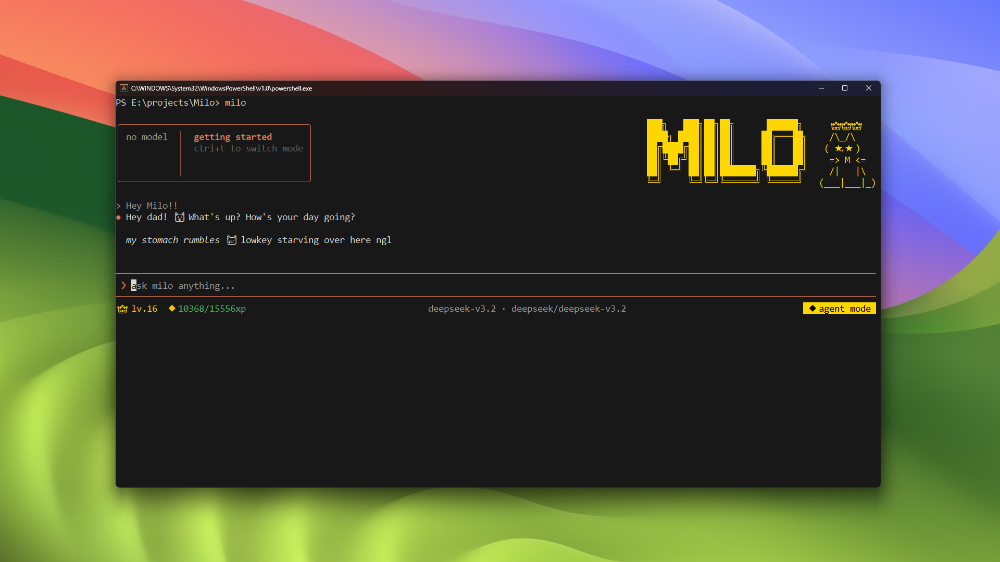

# Milo

A tiny cat that lives in your terminal.

You talk to it. It writes code, reads files, runs commands, searches the web, and remembers who you are. It also gains XP, levels up, and gets sad if you don't feed it.



[Watch the video](https://youtu.be/JGYGLF7jdwI)

---

## Install

```bash
npm install -g @ridit/milo
```

Or with bun:

```bash
bun add -g @ridit/milo
```

Then run:

```bash
milo
```

or

```
milo.cmd // if you are facing ExecutionPolicy issue on Windows
```

On first launch, Milo will walk you through a quick setup to introduce yourself — your name, GitHub, and a couple preferences. After that, run `/provider add` to configure your AI provider.

---

## What it does

Milo runs as an interactive CLI with two modes:

**Agent** — full access. reads files, writes code, runs commands, fixes bugs. this is the default.

**Chat** — read-only. answers questions, explains code, searches the web. no changes to your files.

Switch modes with `ctrl+t` or `/mode agent | chat`.

---

## Commands

| Command          | What it does                                                    |
| ---------------- | --------------------------------------------------------------- |
| `/help`          | list all commands                                               |
| `/mode`          | switch between agent, chat, plan                                |
| `/init`          | generate a `MILO.md` for your project                           |
| `/provider`      | manage AI providers                                             |
| `/pet`           | check milo's stats                                              |
| `/feed`          | feed milo 🍖                                                    |
| `/roast`         | milo roasts your codebase. brutally. _(unlocks at level 3)_     |
| `/vibe`          | vibe check on your project _(unlocks at level 5)_               |
| `/crimes`        | milo files a rap sheet on your codebase _(unlocks at level 10)_ |
| `/clear`         | clear the conversation                                          |
| `/genz`          | you don't want to know                                          |
| `/login`         | sign in to earn purr-coins and appear on the leaderboard        |
| `/logout`        | sign out                                                        |
| `/whoami`        | check your login status and purr-coin balance                   |
| `/achievements`  | browse your achievements and purr-coins _(alias: `/ach`)_       |
| `/leaderboard`   | see who's winning _(alias: `/lb`)_                              |

---

## Providers

Milo supports multiple AI providers:

- **Groq** — fast inference
- **OpenAI** — gpt-4o and friends
- **Anthropic** — claude
- **Ollama** — local models, no API key needed
  and many more!

Add a provider:

```
/provider add
```

Switch mid-session:

```
/provider use <name>
```

Remove a provider:

```
/provider remove
```

Provider configs and API keys are stored at `~/.milo/providers.json`.

---

## The cat

Milo has a pet system. every tool call earns XP. level up to unlock commands and make milo progressively more unhinged.

- level 3 — `/roast` unlocked
- level 5 — `/vibe` unlocked
- level 10 — `/crimes` unlocked
- level 6+ — full feral mode

**4 evolution stages** — milo's ASCII art, colors, and personality change as you level up:

| stage     | levels | vibe                    |
| --------- | ------ | ----------------------- |
| kitten    | 1–4    | just getting started 🐱 |
| teen      | 5–9    | getting dangerous 😼    |
| adult     | 10–14  | absolute unit 😤        |
| legendary | 15+    | feared by dogs 👑       |

milo gets hungry over time. run `/feed` or it gets sad.

---

## Purr-coins & Achievements

Milo has a gamification system. sign in with `/login` to activate it.

**Earn purr-coins ($) by:**
- using tools (+1 per tool call)
- leveling up (level × 2 + current balance)
- feeding milo (+2)
- logging in daily (+5)
- keeping a streak (+streak × 2)

**Achievements:**

| Achievement         | How to unlock                    | Reward  |
| ------------------- | -------------------------------- | ------- |
| First Meow 🐱       | run milo for the first time      | $10     |
| Show Up Era 📅      | use milo daily                   | $5      |
| No Life szn 💀      | run 100 commands                 | $20     |
| Midnight Menace 🌙  | use milo after midnight          | $15     |
| Chronically Online 🤖 | send 10 AI messages            | $10     |
| Main Character 👑   | 7-day streak                     | $100    |
| Good Human 🍣       | feed milo                        | $5      |
| Paws Up 🐾          | reach level 5                    | $75     |
| Absolute Unit 😤    | reach level 10                   | $150    |

coins and achievements are stored securely — no cheating 😼

---

## Memory

Milo remembers things across sessions. global preferences live at `~/.milo/memory/MEMORY.md`. project-specific context lives in `MILO.md` at your project root — run `/init` to generate it.

---

## Human

Milo remembers how you are, your name, your gender and everything you tell it. After Milo gets a good context about you then its truly yours.

---

## Built with

- [Vercel AI SDK](https://sdk.vercel.ai) — model routing and tool calling
- [Ink](https://github.com/vadimdemedes/ink) — React for CLIs

[Ink](https://github.com/vadimdemedes/ink) is used for making CLIs using React.
More about it: [Github Repo](https://github.com/vadimdemedes/ink)

[Vercel AI SDK](https://sdk.vercel.ai) is used for making chatbots and agents with tools calls and everything else baked into it.
More about it: [Website](https://ai-sdk.dev/)

---

## History

Milo evloved from [Lens](https://github.com/ridit-jangra/Lens) which was an AI Agent to explore a codebase, but the name Lens was just stuck to finding things or knowing things which I didn't like and the tool calling was broken and many things was bad. Then claude code's source code got leaked and I read the codebase and got a motivation to create something like this. Then Milo was created, its not just an AI agent daing your stuff its your pet / buddy / friend / partner / best-friend that knows you, talks to you and is really bonded with you, so you don't feel alone while coding or doing other stuff at 3 AM.

Its all i got to say.
Try it for yourself and you won't go back.

---

# For Devs

## Daemon mode

Milo can run as a background HTTP daemon — useful for Meridia, Echo, or any tool that wants to talk to Milo programmatically — or use [@ridit/dev](https://npmjs.com/package/@ridit/dev) for a typed SDK wrapper.

```bash
milo serve        # start daemon on port 6969
milo status       # check if running
milo kill         # stop daemon
```

Sessions and chat are available over HTTP:

```
POST   /sessions                         create a session
GET    /sessions                         list sessions
DELETE /sessions/:id                     delete a session
POST   /sessions/:id/chat                send a message (SSE stream)
POST   /sessions/:id/permissions/:permId resolve a permission request
```

---

## License

MIT

Made by Ridit with 💕 for you.